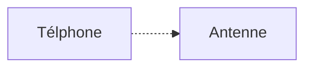

# Cryptographie

## La stéganographie

**Définition :** La stéganographie est l'art de cacher un message dans un autre message (art de la dissimulation)

## La cryptographie

"La cryptographie est la pratique et étude des techniques pour assurer des communications sûres en présence d'adversaires" -- Ron Rivest

### Confidentialité

S'assurer que le message ne peut pas être lu par quelqu'un écoutant le transfert.

### Authenticité

S'assurer de la provenance d'un message et de l'authenticité de son émetteur.

### Intégrité

S'assurer de la non modification du message accidentelle ou intentionnelle.

## Chiffrements historiques

### La scytale

Apparue à Sparte 400 av JC.

**Chiffrer :**

- Enrouler la ceinture sur la scytale
- Écrire le message en plaçant une lettre sur chaque circonvolution  

**Déchiffrer**

Avoir une scytale de même diamètre.

### Transposition rectangulaires

Message : 

"Cela semble toujours impossible, jusqu'à ce qu'on le fasse."

Mot clé : "C R Y P T O"

| C    | R    | Y    | P    | T    | O    |
| ---- | ---- | ---- | ---- | ---- | ---- |
| 1    | 4    | 6    | 3    | 5    | 2    |
| C    | E    | L    | A    | S    | E    |
| M    | B    | L    | E    | P    | O    |
| S    | S    | I    | B    | L    | E    |

 = CMS EOE AEB EBS SPL LLI

### Le chiffrement de César

On fait correspondre A à une autre lettre de l'alphabet puis on recréer un alphabet correspondant.

### Les chiffrements par substitution

**Substitution :** Remplacer chaque lettre par une autre

#### Le carré de Polybe

**Polybe**, historien grec (200 - 125 av JC)


#### Le chiffre des templiers

On substitue les lettres par des symboles issue de la croix de Malte.

## L'analyse des fréquences

- méthodes de cryptanalyse développée par les Arabes au 9e siècle

- Exposée dans le "Manuscrit sur le déchiffrement des messages cryptographiques" d'Al Kindi.

  Dans chaque langue, certaines lettres ou des combinaisons de lettres apparaissent avec une certaines fréquence

**Conclusion :** Le chiffrement par substitution mono alphabétique est très fragile

-> Comment résister à l'analyse des fréquences

Quelque alternatives peu efficaces :

- Mal orthographier le message clair 
- Remplacer chaque mot par un autre mot ou symbole

Des solutions plus sérieuses 

- Substitution homophoniques (Remplacer une lettre par un nombre de symboles proportionnel à la fréquence d'apparition de la lettre)

## Chiffre de Vigenères

On utilise plusieurs alphabet de cryptage.

## Enigma

Pendant la première guerre mondiale le manque de chiffrement efficace créer un gros problème lors des communications sensibles.

Enigma inventée en 1918 par Arthur Scherbius et dont le premier modèle fut exposé en 1923 à Berlin.

**Partie principale :**

- Clavier
- Tableau lumineux
- Rotors
- Tableau de connexion
- Réflecteur

### Simulateur :

https://observablehq.com/@tmcw/enigma-machine

Une machine à trois rotors peut chiffrer avec 26³ alphabets différents.

### La clef

La clef est définie par :

```
ordre des rotors + positions de départ des rotors
```

## Cryptographie symétrique

Deux grandes familles de chiffrement symétrique  

-  Chiffrement à flot
- Chiffrement par blocs

### Chiffrement à flot



$$
e_K(m)= c → d_k(c) = m
$$


La voix est transmise de façon digirale et la communication est chiffrée avec chiffrement à flot

**Idée :** Les bits sont chiffrées un par un donc le nom vient du flux de bits qui arrivent et qui sont chiffrés au fur et à mesure.

**Chiffrement :** 
$$
c_i = m_i + s_i \ mod \ 2 \\ s_i \ suite \ chiffrante
$$
**Déchiffrement :**
$$
m_i = c_i \ mod \ 2
$$


Je veux chiffrer un message :
$$
m = (m_0, m_1, m_2 \}  m_i \in \{0, 1\},  i \ge 0
$$
en un message chiffré :
$$
c= (c_0, c_1, c_2, ... \} \ c_i \in \{0, 1\}
$$
à l'aide d'une suite chiffrante :
$$
s = (s_0, s_1, ...)
$$
**Exemple :** 
$$
c_0 = m_0 + s_0 \ mod \ 2 \\
m_0 = 0, \ s_O = 1 \\
c_0 = 1
$$


L'addition et la soustraction modulo 2 sont la même opération 

