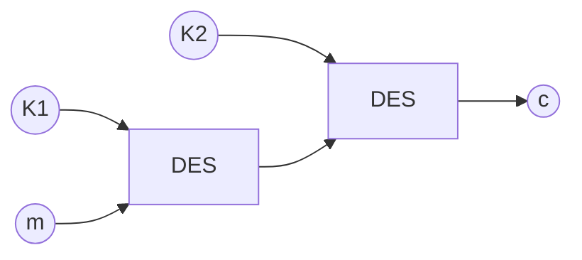

# Cryptographie

## La stéganographie

**Définition :** La stéganographie est l'art de cacher un message dans un autre message (art de la dissimulation)

## La cryptographie

"La cryptographie est la pratique et étude des techniques pour assurer des communications sûres en présence d'adversaires" -- Ron Rivest

### Confidentialité

S'assurer que le message ne peut pas être lu par quelqu'un écoutant le transfert.

### Authenticité

S'assurer de la provenance d'un message et de l'authenticité de son émetteur.

### Intégrité

S'assurer de la non modification du message accidentelle ou intentionnelle.

## Chiffrements historiques

### La scytale

Apparue à Sparte 400 av JC.

**Chiffrer :**

- Enrouler la ceinture sur la scytale
- Écrire le message en plaçant une lettre sur chaque circonvolution  

**Déchiffrer**

Avoir une scytale de même diamètre.

### Transposition rectangulaires

Message : 

"Cela semble toujours impossible, jusqu'à ce qu'on le fasse."

Mot clé : "C R Y P T O"

| C    | R    | Y    | P    | T    | O    |
| ---- | ---- | ---- | ---- | ---- | ---- |
| 1    | 4    | 6    | 3    | 5    | 2    |
| C    | E    | L    | A    | S    | E    |
| M    | B    | L    | E    | P    | O    |
| S    | S    | I    | B    | L    | E    |

 = CMS EOE AEB EBS SPL LLI

### Le chiffrement de César

On fait correspondre A à une autre lettre de l'alphabet puis on recréer un alphabet correspondant.

### Les chiffrements par substitution

**Substitution :** Remplacer chaque lettre par une autre

#### Le carré de Polybe

**Polybe**, historien grec (200 - 125 av JC)


#### Le chiffre des templiers

On substitue les lettres par des symboles issue de la croix de Malte.

## L'analyse des fréquences

- méthodes de cryptanalyse développée par les Arabes au 9e siècle

- Exposée dans le "Manuscrit sur le déchiffrement des messages cryptographiques" d'Al Kindi.

  Dans chaque langue, certaines lettres ou des combinaisons de lettres apparaissent avec une certaines fréquence

**Conclusion :** Le chiffrement par substitution mono alphabétique est très fragile

-> Comment résister à l'analyse des fréquences

Quelque alternatives peu efficaces :

- Mal orthographier le message clair 
- Remplacer chaque mot par un autre mot ou symbole

Des solutions plus sérieuses 

- Substitution homophoniques (Remplacer une lettre par un nombre de symboles proportionnel à la fréquence d'apparition de la lettre)

## Chiffre de Vigenères

On utilise plusieurs alphabet de cryptage.

## Enigma

Pendant la première guerre mondiale le manque de chiffrement efficace créer un gros problème lors des communications sensibles.

Enigma inventée en 1918 par Arthur Scherbius et dont le premier modèle fut exposé en 1923 à Berlin.

**Partie principale :**

- Clavier
- Tableau lumineux
- Rotors
- Tableau de connexion
- Réflecteur

### Simulateur :

https://observablehq.com/@tmcw/enigma-machine

Une machine à trois rotors peut chiffrer avec 26³ alphabets différents.

### La clef

La clef est définie par :

```
ordre des rotors + positions de départ des rotors
```

## Cryptographie symétrique

Deux grandes familles de chiffrement symétrique  

-  Chiffrement à flot
- Chiffrement par blocs

### Chiffrement à flot


$$
e_K(m)= c → d_k(c) = m
$$


La voix est transmise de façon digirale et la communication est chiffrée avec chiffrement à flot

**Idée :** Les bits sont chiffrées un par un donc le nom vient du flux de bits qui arrivent et qui sont chiffrés au fur et à mesure.

**Chiffrement :** 
$$
c_i = m_i + s_i \ mod \ 2 \\ s_i \ suite \ chiffrante
$$
**Déchiffrement :**
$$
m_i = c_i \ mod \ 2
$$


Je veux chiffrer un message :
$$
m = (m_0, m_1, m_2 \}  m_i \in \{0, 1\},  i \ge 0
$$
en un message chiffré :
$$
c= (c_0, c_1, c_2, ... \} \ c_i \in \{0, 1\}
$$
à l'aide d'une suite chiffrante :
$$
s = (s_0, s_1, ...)
$$
**Exemple :** 
$$
c_0 = m_0 + s_0 \ mod \ 2 \\
m_0 = 0, \ s_O = 1 \\
c_0 = 1
$$

**Exemple chiffrer la lettre 'A' ASCII *1000001* ** :
$$
m_6 \ m_5 \ \ m_0 = 1000001 \\
s_6 \ s_5 \ \ s_0 \ \ \ \ \ = 0011001
$$


**Question** comment générer la suite chiffrante *s* ?

La suite s doit ressembler à une suite aléatoire

1. Vrais générateurs basés sur des phénomènes imprévisibles

   - Dés, pile ou face,loto, bruit thermique, mouvement de la souris, frappes sur le clavier. L'inconvénient c'est que c'est très lent, il n'est pas possible de reproduire exactement la même suite chiffrante.

2. Générateurs de nombre pseudo-aléatoire (PRNG)

   Suite qui ont l'air aléatoire calculé de façon déterministe qu'on peut reproduire. En général ells sont des bonnes propriétés statistiques.

   Calculés récursivement à partir d'une valeur initiale, la graine.
   $$
   S_0 = \ graine \\
   S_{i+1} = f(S_i) \ i \ge 0
   $$
   

*Exemple :* `rand()` de C
$$
S_0= 12345 \\
S_{i+1} = 1103515245 \ S_i + 12345 \ mod \ 2^{31}
$$

3. Générateurs de nombres aléatoires cryptographiquement sûrs.

   Ce sont des **PRNG** mais qui sont imprévisibles.

*Définitions :* 

> Une suite s est dite imprévisible si étant n bits générés Si, Si+1,... Si+n il est calculatoirement impossible de prédire Sn.

> Un chiffrement est dit "inconditionnellement sûr" ou "parfait ". S'il ne peut pas être cassé même si l'attaquant possède des ressources de calcul infinis.
>
> Claude Shannon - 1949 

Un tel chiffrement existe et s'appelle "chiffre de Vernam", ou "Masque jetable" ou "One-Time-Pad (OTP)"

Définition de l'**OTP** :

> L'OTP est un chiffrement à flot où :
>
> 1. La suite chiffrante s est générée avec avec un vrai générateur aléatoire
> 2. Chaque suite n'est utilisé qu'une seule fois.

$$
c = m \oplus s
$$


*Exemple :* 
$$
2 \ bits \\
c = 10
\\
S_1 = 00, \ S_2 = 01, \ S_3 = 10, \ S_4 = 11 \\
\\
c \oplus S_1 = 10 \\
c \oplus S_2 = 11 \\
c \oplus S_3 = 00 \\
c \oplus S_4 = 01 \\
$$

$$
c_1 = m_1 \oplus s \\
c_2 = m_2 \oplus s \\
c_1 \oplus c_2 = m_1 \oplus s \oplus m_2 \oplus s = m_1 \oplus m_2
$$

Inconvénients de l'OTP :

1. La suite chiffrante doit être aussi longue que le message a chiffré (problèmes de temps et de mémoire)
2. La suite ne peut être utilisée qu'une seule fois
3. La suite doit être transmise


Alice et Bob doivent se mettre d'accord sur la clé secrète

**Toute la sécurité repose sur la qualité du PRNG**

Pratiquement tous les PRNG utilise de nos jours pour le chiffrement à flot sont basés sur des registres à décalage à rétroaction linéaire.

#### Registre à décalage à rétroaction linéaire (LFSR)


Ou sous forme de formule :
$$
S_{i+3} = S_{i+1} \oplus S_i \text{Pour tout } i \ge 0
$$


**Description générale d'un LFSR :**
$$
C_0, C_1 \ \ C_{n-1} \in \text{{0, 1}} \\
C_i = 0  \ \text{On XOR le bit }S_i \\
C_i = 1 \ \text{On ne XOR pas le bit }S_I 
$$
Valeurs initiales S0, S1, ..., Sm-1 :
$$
S_m = S_0C_0 \oplus S_1C_1 \oplus ... \oplus S_{n-1}C_{n-1} 
$$

$$
S_{m+i} = \oplus^{m-1}_{i=0} S_{i+j} \ C_j
$$

*Exemple :* m=4
$$
C_3 = C_2 = 0, C_1 = C_0 = 1 \\
\text{Période }= 2^4 - 1 = 15
$$


*Exemple :* m=4
$$
C_3 = C_2 = C_1 = C_0 = 1 \\\text{Période }= 5
$$


### Chiffrement par bloc

Dans ce système, le texte clair est découpé en blocs de taille fixe et chiffré bloc par bloc.


On traite donc chaque bloc l'un après l'autre.
$$
F:\{0,1\}^n * \{0,1\}^k -> \{0,1\}^h \\
(m,k) -> c=F(m,k)
$$


Deux paramètres importants :

- La taille de blocs **n** *64 bits ou 128 bits* 
- La taille de la clef **K** *80-256 bits*

La taille de la clef doit être telle qu'une recherche exhaustive ne soit pas disponible.

#### Comment construire un chiffrement par blocs ? (Construction de la fonction F)

Itérer une fonction de tour **F**, plusieurs fois.

La clé que Alice et Bob ont échangé est appelée la "clef maître"


Un algorithme de cadencement de clés est une fonction qui prend en entrée la clé maître K et produit en sortie une suite de sous clés K1, ..., Kr.

> **Exemple "simple" de cadencement de clé**
> $$
> K = (K_0,...,K_{127}) K_i \in \{0,1\} \\
> K_1 = (K_1, K_2, ..., K_{127}, K_0) \\
> K_2 = (K_2, ..., K_{127}, K_0, K_1)
> $$

**Avantages :**

1. Implémentation compacte.
2. Analyse de sécurité plus simple.

#### Comment construire la fonction de tour F ?

Principes de confusion et de diffusion (Claude Shannon)

"Communication Theory of Secrecy Systems" 1949

##### La confusion

Rendre les relations entre les bits de la clé, les bits du message clair et les bits du message chiffré le plus complexe possible.

> **Exemple :**
> $$
> \text{Clé secrète }K=(K_1, K_2, K_3, K_4) \ K_i \in \{0,1\} \\
> \text{Message clair }m=(m_1, m_2, m_3, m_4) \ m_i \in \{0,1\} \\
> \text{Message chiffré }c=(c_1, c_2, c_3, c_4) \ c_i \in \{0,1\}
> $$
>
> $$
> c_1 = m_1 \oplus m_2 \oplus  K_1 \oplus K_2 \\
> c_2 = m_2 \oplus m_3 \oplus  K_2 \oplus K_3 \\
> c_3 = m_3 \oplus m_4 \oplus  K_3 \oplus K_4 \\
> c_4 = m_4 \oplus m_3 \oplus  K_4 \oplus K_1 \\
> $$
>
> 

Ce système n'est pas bon pour le principe de confusion car il est linéaire, donc pas complexe.

Pour assurer la confusion il faut assurer la non linéarité.

En pratique, pour assurer la linéarité la plupart du temps on utilise des fonctions appelés "Boites-S"  .

> **Exemple de boite S :**
> $$
> S \{0,1\}^4 -> \{0,1\}^4
> $$
>
> | x        | 0    | 1    | 2    | 3    | 4    | 5    | 6    | 7    | 8    | 9    | 10   | 11   | 12   | 13   | 14   | 15   |
> | -------- | ---- | ---- | ---- | ---- | ---- | ---- | ---- | ---- | ---- | ---- | ---- | ---- | ---- | ---- | ---- | ---- |
> | **S(x)** | 8    | 6    | 7    | 9    | 3    | 12   | 10   | 15   | 13   | 1    | 14   | 4    | 0    | 11   | 5    | 2    |

##### La diffusion 

Chaque bit du texte clair et chaque bit de la clé  dovent avoir une influence sur une grande partie du texte chiffré.

>**Exemple :**
>$$
>C_0 = m_0 \oplus k_0 \\
>C_0 = m_1 \oplus k_1 \\
>C_0 = m_2 \oplus k_2 \\
>C_0 = m_3 \oplus k_3 \\
>$$
>

Pour assurer la diffusion on utilise des fonctions linéaires.

Chiffrement par produit (Claude Shannon)

Combiner la diffusion et la confusion pour assurer un chiffrement robuste

#### Réseau de Feistel

Introduit par Horst Feistel au début des années 1980.

Couper en deux le bloc de message clair m=(L_0, R_0)


Pour chaque tour i = 0, r = 1 faire :

- $$
  L_{i+1}=R_i \\
  $$

- $$
  R_{i+1}=L_i \oplus F(K_{i-1}, R_1)
  $$

Bloc chiffré :
$$
C=(C_0, R_0) = (L_{r+1}, R_{r+1})
$$

##### Propriété d'un réseau de Feistel

Déchiffrement avec :
$$
k=(k_1, k_2,..., k_r)
$$
est également au chiffrement avec
$$
k'=(k_r, ..., k_1)
$$

#### Data encryption Standard (DES)

- 1973 : Le national Bureau of standards (NBS) américain demande la création d'un algorithme de chiffrement pour des applications commerciales.
- IBM : Propose Lucifer conçu en 1971 par Horst Feistel
- DES est crée et devient un standard en 1977 (FIPS PUB 46)

Taille de blocs 64 bit

Taille de clé de 56 bits.

##### Fonctionnement 

L'algorithme DES transforme un bloc de 64 bits en un autre bloc de 64 bits. Il manipule des clés individuelles de 56 bits, représentées par  64 bits (avec un bit de chaque octet servant pour le [contrôle de parité](https://fr.m.wikipedia.org/wiki/Somme_de_contrôle)). Ce système de [chiffrement symétrique](https://fr.m.wikipedia.org/wiki/Chiffrement_symétrique) fait partie de la famille des chiffrements itératifs par blocs, plus particulièrement il s'agit d'un [schéma de Feistel](https://fr.m.wikipedia.org/wiki/Schéma_de_Feistel) (du nom de [Horst Feistel](https://fr.m.wikipedia.org/wiki/Horst_Feistel) à l'origine du chiffrement [Lucifer](https://fr.m.wikipedia.org/wiki/Lucifer_(cryptographie))). 

D'une manière générale, on peut dire que DES fonctionne en trois étapes :

- permutation initiale et fixe d'un bloc (sans aucune incidence sur le niveau de sécurité) ;
- le résultat est soumis à 16 itérations d'une transformation, ces  itérations dépendent à chaque tour d'une autre clé partielle de 48 bits. Cette clé de tour intermédiaire est calculée à partir de la clé  initiale de l'utilisateur (grâce à un réseau de tables de substitution  et d'opérateurs [XOR](https://fr.m.wikipedia.org/wiki/OU_exclusif)). Lors de chaque tour, le bloc de 64 bits est découpé en deux blocs de 32 bits, et ces blocs sont échangés l'un avec l'autre selon un schéma de  Feistel. Le bloc de 32 bits ayant le poids le plus fort (celui qui  s'étend du bit 32 au bit 64) subira une transformation ;
- le résultat du dernier tour est transformé par la fonction inverse de la permutation initiale.

DES utilise huit tables de substitution (les [S-Boxes](https://fr.m.wikipedia.org/wiki/S-Box)) qui furent l'objet de nombreuses controverses quant à leur contenu. On  soupçonnait une faiblesse volontairement insérée par les concepteurs.  Ces rumeurs furent dissipées au début des années 1990 par la découverte  de la [cryptanalyse différentielle](https://fr.m.wikipedia.org/wiki/Cryptanalyse_différentielle) qui démontra que les tables étaient bien conçues.

**Schéma :**


Boite E : Prend en entrée un 32 bits et va ressortir quelque chose en 48 pour cela il va recopier de manière aléatoire certain bits.

Boite S : (*substitution box*), terme anglais désignant une table de [substitution](https://fr.m.wikipedia.org/wiki/Substitution) utilisée dans un algorithme de [chiffrement symétrique](https://fr.m.wikipedia.org/wiki/Cryptographie_symétrique). Une S-Box contribue à la « confusion » (terme employé par [Claude Shannon](https://fr.m.wikipedia.org/wiki/Claude_Shannon)) en rendant l'information originale inintelligible. Les S-Boxes permettent de casser la [linéarité](https://fr.m.wikipedia.org/wiki/Linéarité) de la structure de chiffrement et leur nombre varie selon les algorithmes.

Boite P : Permutation sur les 32 bits.

##### La fin du DES

- 1992 : Cryptanalyse différentielle (attaque théorique, 2⁴⁷ textes clairs choisis)
- 1994 : Cryptanalyse linéaire (attaque pratique, une clef est récupérée)
- 1997 : DESCHALL Project (3 mois pour retrouver la clef)
- 1999 : Deep Crack, distributed net (23 heures pour retrouver la clé)
- 2004 : Le standard a été **abandonné**

#### Double DES

Une idée pour rallonger la clef du DES était de chiffrer chaque message avec DES deux fois avec 2 clefs différentes.



$$
c = DES_{K_2}(DES_{K_1}(m))
$$


Taille des blocs : 64 bits

Taille de la clef : 112 bits

Recherche exhaustive : 2¹¹² clés

##### L'attaque par le milieu

Cette attaque vise à retrouver la cle (K1, K2) du chiffrement

L'attaquant possède un couple clair-chiffré (m,c)

Le message m a été chiffré en c avec la clef inconnue (K1, K2) qu'on vise à retrouver.

 L'attaquant commence à construire deux listes L_m et L_i

 ```mermaid
graph LR 

E --> B
F --> C
A --> B

B --> C
C --> D

A --> C
A((m))
B[DES]
C[DES]
D((c))
E((K1))
F((K2))

 ```

- Pour toute clef :
  $$
  k \in \{0,1\}^{56}
  $$
  l'attaquant calcul DES_k(m), et il stocke le résultat dans une liste L_m

- Pour toute clef K appartient à {0,1}⁵⁶ l'attaquant calcul DES⁻¹_k(m), et il stocke le résultat dans une liste L_i

Soit t un élément commun aux deux listes :
$$
t = DES_{k_1}(m) \\
t = DES_{k_2'}^{-1}(c) => c = DES_{k_2'}(t) =>^{(1)} c = DES_{k_2'}(DES_{k_1'}(m))
$$
Le couple (k_1', k_2') est une clef candidate pour la clef (k_1, k_2) recherche.

**Complexité en mémoire :**
$$
2 * 2^{56} \ couples \ (chiffré \ clef)
$$
**Complexité en temps :** Trier les deux tableaux *O(n log n)*
$$
2 * 2^{56}*56 = 2^{63}
$$


- Recherche des collisions dans les listes triés :
  $$
  O(n) \ 2^{56} \ dans \ notre \ cas
  $$
  

|                          | Temps | Mémoire |
| ------------------------ | ----- | ------- |
| Attaque par force brute  | 2¹¹²  | 0       |
| Attaque par dictionnaire | 0     | 2¹¹²    |
| Attaque par le milieu    | 2⁶³   | 2⁵⁷     |

#### Triple DES (3DES)


### Théorème des restes chinois

#### Problème du trésor de pirate

Une bande de 17 pirates possède un trésor constitué de pièces d'or. Ils projettent de se les partager également, et de donner le reste au cuisinier chinois. Celui-ci recevrait alors 3 pièces. Mais les pirates se querellent, et si d'entre eux sont tués. Un nouveau partage donnerait au cuisinier 4 pièces. Dans un naufrage ultérieur, seuls le trésor, six pirates et le cuisinier sont sauvés, et le partage donnerait alors 5 pièces d'or à ce dernier. Quelle est la fortune minimale que peut espérer le cuisiner s'il décide d'empoisonner le reste des pirates ? 

#### **Modélisation du problème ** : 

Soit x le nombre de pièces d'or.
$$
x \equiv 3 \ mod \ 17 \\ 
x \equiv 4 \ mod \ 11 \\
x \equiv 5 \ mod \ 6 \\
$$

#### Théorème

Soient m_1... m_r des entiers deux à deux premiers entre eux (c'est à dire pgcd(m_i, m_j) =1, i différent de j). Alors, pour tout entiers a_1, a_2, ..., a_r. Il existe un entier x, unique modulo M ) m_1, m_2... m_r tel que :
$$
x \equiv a_1 \ mod \ m_1 \\
x \equiv a_r \ mod \ m_r
$$

#### Démonstration

$$
\text{(Existence) Pour chaque 1} \le i \le r, \text{les entiers }m_i \ et \ m'_i = \frac{M}{m_i}=\frac{m_1... m_{i-1}*m_i*m_{i+1}...m_r}{m_i} \\ \text{sont premiers entre eux }(pgcd(m_i,m'_i)=1, \ i=1,...,r) \\
\text{En utilisant le théorème d'Euclide étendu pour le couple }(m_i, m'_i) \text{on peut trouver des entiers } u_i \ et \ v_i \ tel \ que :\\ \ 
u_im_i +v_im'_i=1 \\
e_i = v_im'_i \\
\text{On a que }e_i \equiv 1 \ mod \ m_i de 1 \\
e_i \equiv 0 \ mod \ m_j de (j \neq i)\\
\text{(Parce que } e_i = v_im'_i=v_im_1...m_j...m_r)
$$

#### Résolution

$$
m_1 = 17, m_2 = 11, m_3 = 6 \\
m'_1 = \frac{m_1*m_2*m_3}{m_1} = m_2 * m_3 = 11 * 6 = 66 \\
m'_2=m_1*m_3= 17*6 = 102 \\
\underline{m'3 = m_1*m_2 = 17 * 11 = 187} \\
--- \\
\text{Algorithme d'Eulide étendu pour :} \\
(m_1, m'_1)=(17, 66) \\
(-31)*17+8*66 = 1 \ e_1=8*66 \\
--- \\
(m_2, m'_2)=(11, 102) \\
(-37)*11+4*102 = 1 \ e_2=4*102 \\
--- \\
(m_3, m'_3)=(6, 187) \\
(-31)*6+1*187 = 1 \ e_3=187 \\
$$

