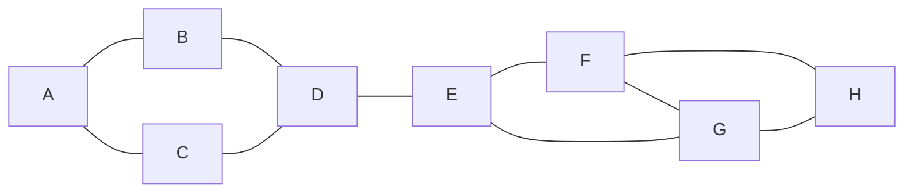
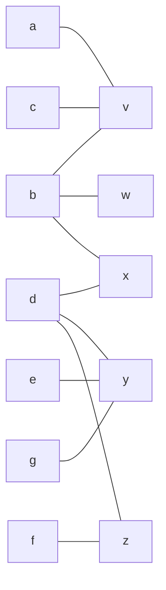
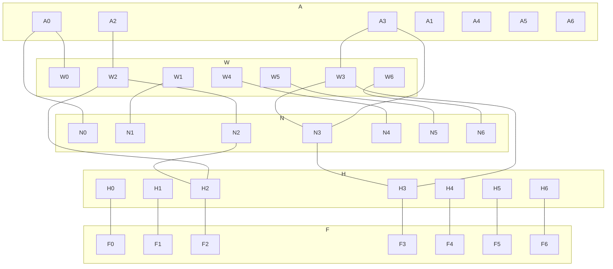
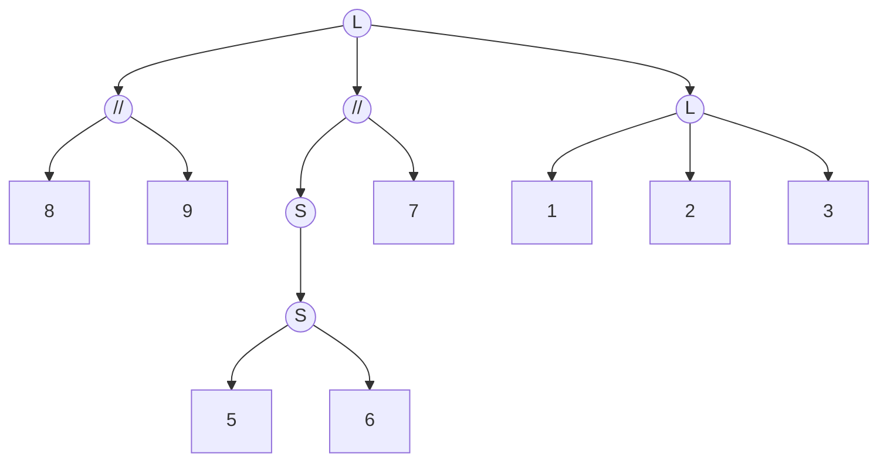
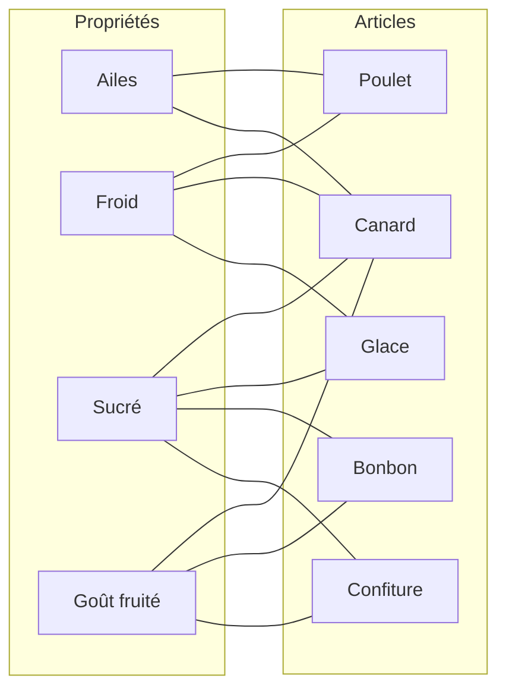

# DAAR - Session 2

## Duplication

### Cas liste

*Détecter si un if est utilisé 2 fois en temp O(n + max input - min input*

1. **O(|tab|)** : `Init tab = [0,0,0... 0]`
2. **O(n)** : `map(f, id)`
3. **O(n)** : `return tel qu'il existe i tant tab[i] >= 2`

### Cas graphe



**Definition de jumaux et vrai-jumaux :**

Soit $G=(V,E)$ un graphe.

Soit $u \neq v$ deux sommets difféents de $G$.

- $\{u,v\}$ est une paire de **vrai-jumaux** *ssi* l'ensemble de leur voisin est exactement le même.
  - $     \left\{        \begin{array}{ll}            N(u) \text{\\} \{v\} = N(v) \text{\\} {u} \\    uv \notin E       \end{array}    \right. \equiv N(u)=N(v) $
  
  - **Exemple :** B & C sont vrai jumaux
- $\{u,v\}$ est une paire de **jumaux** *ssi* leur exemble de voisins exétrieurs est le même
  - $     \left\{        \begin{array}{ll}            N(u) \text{\\} \{v\} = N(v) \text{\\} {u}      \end{array}    \right. \equiv \forall s \notin \{u,v\}, (s,u\in E \equiv s,v \in E)$
  - **Exemple :** F & G sont des jumaux 


#### Algo en $O(n^3)$ 
```
Récupérer la liste de voisins de chaque noeuds.
Retirer u et v de ces des listes
Comparer ces listes
```
#### Algo en $O(n+m)$ avec affinage de partition

**Avec un gaphe biparti :**


**:warning: Entre chaque STEP on applique le pivot a P*n*.** 

```
STEP 1 :
    P1 = abcdefg
    pivot = N(v) = {a,b,c}

STEP 2 :
	P2 = abc dcfg
	pivot = N(w) = {b}
	
STEP 3 :
	P3 = ac b defg
	pivot = N(x) = {b,d}

STEP 4 :
	P4 = ac b d efg
	pivot = N(y)= {d,e,g}

STEP 5:
	P5 = ac b d eg f
	pivot = N(z) = {d,f}
 	
 	P6 = ac b d eg f
 	
```

Les vrai-jumaux sont les ensembles restant de taille 2

**Complexité :**

| STEP | Complexité  |
| ---- | ----------- |
| 1    | 3 = deg(v)  |
| 2    | 1 = deg(w)  |
| 3    | 2 = deg(x)  |
| 4    | 3 = deg (y) |
| 5    | 2 = deg(z)  |

**Total :** $\sum_{v \in V} deg(v)=O(m)$

### Cas de graphe temporel

$G_\Tau$ :



**Définition jumaux éternels et $\Delta$-jumaux :**

- $\{u,v\}$ jumaux éternals *ssi* $\forall i, \{u,v\}$ jumaux dans $G_\Tau $
- Pour $\Delta \in N,\{u,v\}$ $\Delta$-jumaux *ssi* $\exist t$ tel que $\{u,v\}$ jumaux dans $G_i \forall t \le i < t + \Delta$

## Intervalles

### TME

[Intervalles.md](./Session 2 - TME1/Intervalles.md)

### Rappels intervalles dans $\mathbb{R}/\mathbb{N}$

- $\cap$ : Deux intervalles qui s'intersectent
- $\cup$ : Union de deux intervalles
- $\text{ \\ }$ : Privé de 


### Module (intervalles de permutation, clusters de zéro...)

**Exemple des gènes :**

| Nom de l'espèce | Gènes |      |      |      |      |      |      |      |      |
| --------------- | ----- | ---- | ---- | ---- | ---- | ---- | ---- | ---- | ---- |
| ID              | 1     | 2    | 3    | 4    | 5    | 6    | 7    | 8    | 9    |
| P               | 9     | 8    | 5    | 6    | 4    | 7    | 3    | 2    | 1    |

**Intervalles communs :**

- `{1,2,3}`
- `{1,2}`
- `{2,3}`
- `{1, ..., 7}`
- `{1, ..., 8}`
- `{1, ..., 9}`
- `{9,8}`
- `{5,6}`
- `{4,5,6}`
- `{4, ..., 7}`
- `{4, ..., 9}`

**V = `{1,2,3,... 9}`** :



>L : Linéaire
>
>S : ???
>
>// : Non typé

### Biclique

**Exemple :**

| *ID article \ Id propriété*   | ailes | Froid | Sucré | Goût fruité |
| ----------------------------- | ----- | ----- | ----- | ----------- |
| **Poulet**                    | 1     | 1     | 0     | 0           |
| **Canard congelé à l'orange** | 1     | 1     | 1     | 1           |
| **Glace vanille**             | 0     | 1     | 1     | 0           |
| **Bonbon**                    | 0     | 0     | 1     | 1           |
| **Confiture**                 | 0     | 0     | 1     | 1           |

Ce tableau nous donne les aliments en fonctions de prpriétés arbitaire. Cela permet de créer un graphe bipartie avec d'un côté les aliments et de l'autre les propriétés :



