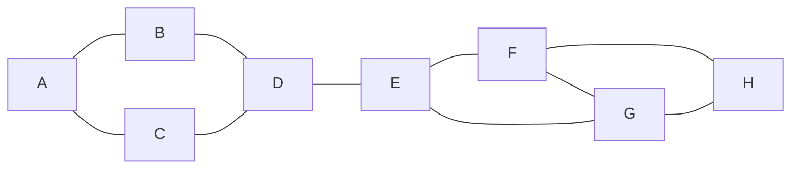
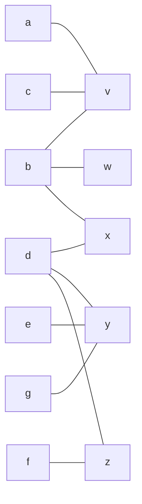

# DAAR - Session 2

## Duplication

### Cas liste

*Détecter si un if est utilisé 2 fois en temp O(n + max input - min input*

1. **O(|tab|)** : `Init tab = [0,0,0... 0]`
2. **O(n)** : `map(f, id)`
3. **O(n)** : `return tel qu'il existe i tant tab[i] >= 2`

### Cas graphe



**Definition de jumaux et vrai-jumaux :**

Soit $G=(V,E)$ un graphe.

Soit $u \neq v$ deux sommets difféents de $G$.

- $\{u,v\}$ est une paire de **vrai-jumaux** *ssi* l'ensemble de leur voisin est exactement le même.
  - $     \left\{        \begin{array}{ll}            N(u) \text{\\} \{v\} = N(v) \text{\\} {u} \\    uv \notin E       \end{array}    \right. \equiv N(u)=N(v) $
  
  - **Exemple :** B & C sont vrai jumaux
- $\{u,v\}$ est une paire de **jumaux** *ssi* leur exemble de voisins exétrieurs est le même
  - $     \left\{        \begin{array}{ll}            N(u) \text{\\} \{v\} = N(v) \text{\\} {u}      \end{array}    \right. \equiv \forall s \notin \{u,v\}, (s,u\in E \equiv s,v \in E)$
  - **Exemple :** F & G sont des jumaux 


#### Algo en $O(n^3)$ 
```
Récupérer la liste de voisins de chaque noeuds.
Retirer u et v de ces des listes
Comparer ces listes
```
#### Algo en $O(n+m)$ avec affinage de partition

**Avec un gaphe biparti :**


**:warning: Entre chaque STEP on applique le pivot a P*n*.** 

```
STEP 1 :
    P1 = abcdefg
    pivot = N(v) = {a,b,c}

STEP 2 :
	P2 = abc dcfg
	pivot = N(w) = {b}
	
STEP 3 :
	P3 = ac b defg
	pivot = N(x) = {b,d}

STEP 4 :
	P4 = ac b d efg
	pivot = N(y)= {d,e,g}

STEP 5:
	P5 = ac b d eg f
	pivot = N(z) = {d,f}
 	
 	P6 = ac b d eg f
 	
```

Les vrai-jumaux sont les ensembles restant de taille 2

**Complexité :**

| STEP | Complexité  |
| ---- | ----------- |
| 1    | 3 = deg(v)  |
| 2    | 1 = deg(w)  |
| 3    | 2 = deg(x)  |
| 4    | 3 = deg (y) |
| 5    | 2 = deg(z)  |

**Total :** $\sum_{v \in V} deg(v)=O(m)$
