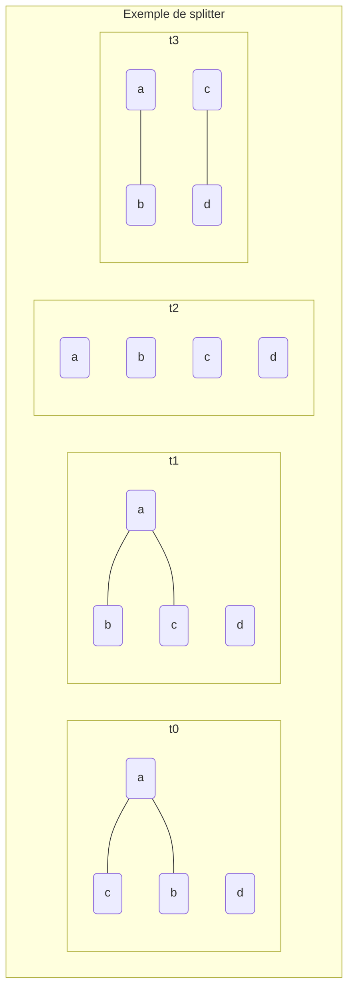

# Dissertation TME8

## Définitions

**Graphe temporel :** Un graphe temporel $G$ est une séquence de graphes indexés par un ensemble d’entiers $T$ représentant les instants temporels. Les graphes sont ici non orientés et non pondérés.

**Vrai jumeaux :**  $\{u,v\}$ est une paire de **vrai-jumeaux** si et seulement si l'ensemble de leur voisin est exactement le même.

$     \left\{        \begin{array}{ll}            N(u) \text{\\} \{v\} = N(v) \text{\\} {u} \\    uv \notin E       \end{array}    \right. \equiv N(u)=N(v) $

**Jumeaux :** $\{u,v\}$ est une paire de **jumeaux** si et seulement si leurs voisins extérieurs est le même

$     \left\{        \begin{array}{ll}            N(u) \text{\\} \{v\} = N(v) \text{\\} {u}      \end{array}    \right. \equiv \forall s \notin \{u,v\}, (s,u\in E \equiv s,v \in E)$

**Jumeaux éternels :** Pour être des jumeaux éternels $\{u,v\}$ doivent être jumeaux dans chacun des $T$ graphes du graphe temporel $G$.

**$\Delta$-Jumeaux :** Pour être des $\Delta$-jumeaux $\{u,v\}$ doivent être jumeaux dans $\Delta$ graphes consécutifs indexés dans $G$, avec $\Delta$ un entier respectant $\Delta < T$.

## Introduction

**Problématique :** *Comment énumérer l'ensemble des pairs de jumeaux éternels et de $\Delta$-Jumeaux de façon instantanés a partir de graphes temporels collectés dans le monde réel ? Peut-on le confirmer numériquement par l'implémentation de ces algorithmes ?* 

Les graphes temporels permettent de représenter des données de différents domaines tels que les horaires de transports, de navigations.. De manière générale l'ensemble des données ayant une notion de temps. 

Les notions de jumeaux éternels et $\Delta$-Jumeaux permettent de comprendre deux réalités sur un graphe temporel :

- Les jumeaux éternels sont des données redondantes et donc inutile à conserver en $T$ exemplaires. Leur suppression permet d'accélérer les traitements sur les graphes temporels.
- Les $\Delta$-Jumeaux peuvent être les preuves de schémas ou de modèles dans le flux de donnée et sont donc nettement plus intéressant a rechercher pour les étudier.

## Algorithmes existants

### NAÏF

L'algorithme sert a prouver que le problème est solvable. Ici il s'agit d'une recherche exhaustive. 

Cet algorithme existe en deux versions, l'une pour les jumeaux éternels et l'autre pour les $\Delta$-Jumeaux :

**Jumeaux éternels :**

```
Entrée : Graphe temporel G (T, V, E)
Sortie : Liste des jumeaux éternels dans G

deltaTwinsLastInstant = Jumeaux de G à t0
resultat = liste de jumeaux vide

Pour t chaque instant dans T:
	twinsInstant = jumeaux de G à l'instant t
	tmp = liste de jumeaux vide
	
	Pour chaque jumeaux g dans deltaTwinsLastInstant :
		Pour chaque jumeaux e dans twinsInstant :
			Si g == e :
				ajouter g à tmp

	deltaTwinsLastInstant = tmp

resultat = deltaTwinsLastInstant
retourner resultat	
```

La complexité est de $O(n^3*\tau)$ avec $\tau = |T|$. 

**$\Delta$-Jumeaux : **

```
Entrée : Graphe temporel G (T, V, E), entier d
Sortie : Liste des delta-jumeaux dans G avec un delta de d

deltaTwins = liste de jumeaux vide
twinsAtT = liste de jumeaux vide

Pour chaque instant t dans T:
	twinsAtT = jumeaux de G à l'instant t
	
	Pour chaque jumeaux e dans twinsAtT:
		Si temps d'existence de e >= d alors:
			Ajouter e dans deltaTwins s'il n'y est pas déjà

retourner deltaTwins			
```

La complexité est de $O(n^3*\tau*d)$ avec $\tau = |T|$. 

### Edge Iteration algorithm for eternal-twins listing

#### Structure de donnée utilisée

**Matrice d'adjacence :** Il s'agit d'une façon de représenter un graphe au travers d'une matrice d'entier. Par exemple s'il existe un lien entre $u$ et $v$ alors $(u,v) = 1$. Prenons un graphe de trois sommets : $a, b$ et $c$ avec une arrête entre $a$ et $b$ :

```
  a b c
a 0 1 0
b 1 0 0
c 0 0 0
```

Dans le cadre d'une graphe temporel il s'agit d'une liste de matrice d'adjacence indexés par $T$ entiers.

Ce type de représentation présente un problème majeur : la place prise en mémoire. En effet la taille croît de façon polynomiale $n^2$ avec $n$ le nombre de sommets. Pour un graphe temporel cette problématiques est renforcé par la multiplication des graphes. On arrive a $n^2 * \tau$ avec $\tau$ la taille de l'historique du graphe temporel.

#### Présentation

>**Entrées :** Graphe temporel $L : (T,V,E)$ 
>
>**Sortie :** Liste de tous les jumeaux éternels

Le but de cet algorithme est donc de retourner la liste de l'ensemble des pairs de sommets jumeaux éternel de façon indépendante de la taille de l'historique $\tau$ du graphe temporel $L$ passé en entrée.

Pour cela l'algorithme va s'appuyer la technique dites "*triangular structure of splitters*" ou "structure triangulaire de séparation", l'objectif va être de trouver un sommet $u$ qui prouve que $w$ et $v$ ne sont pas liés. De plus cette technique a comme avantage supplémentaire de ne pas nécessiter obligatoirement des matrices d'adjacence en entrée, en effet une simple liste d'arêtes est suffisante.

On considère d'abord chaque couple comme des jumeaux éternels. Ensuite l'objectif va être, pour chaque couple, de rechercher si un sommet ne permet de prouver qu’ils ne forment pas des jumeaux éternels. En effet si l'on prend une arrête liant les sommets $v$ et $u$ à un instant $t$ et un sommet $w$ et que ce dernier n'est lié à aucun moment avec $u$ alors $v$ et $w$ ne peuvent pas former un jumeau éternel.



Dans cet exemple on peut observer le couple $(b, c)$. Si l'on applique la procédure décrite plus haut on voit qu'ils sont jumeaux dans $t0, t1, t2$ mais dans $t3$ si l'on prend par exemple $d$ comme splitter on observe qu'il n'y aucune arrête liant $a$ et $d$. Donc le couple $(b,c)$ ne forme pas un jumeau éternel. 

On voit ici qu'il est donc plus facile de déterminer dans quel cas des sommets ne forment **pas** un couple de jumeaux parfait que l'inverse.

Cette technique est le centre de l'algorithme et permet de se retrouver avec à la fin une matrice donnant l'ensemble des couples de jumeaux éternels.

Il est a noté que deux versions de cet algorithme existe : la version MEI pour *Matrix Edge Iteration* et MLEI pour *Matrix-less Edge Iteration*. Dans la première version une matrice d'adjacence est utilisée en entrée alors que dans la seconde l'entrée est juste l'ensemble d'arêtes $E$ donnée dans le désordre.

#### Analyse

La complexité de cet algorithme en temps est de $O(m*n+n^2)$ quand il s'agit de l'implémentation avec la matrice soit MEI, lors de l'implémentation MLEI sans matrice la complexité temporelle augmente à $O(m^2*n+n^2)$ alors que la complexité spatiale passe de $O(n^2*\tau)$ en MEI à $O(m)$ avec MLEI.

Le MEI pose problème car lorsque commence a devenir importante il n'est pas possible de faire s'exécuter le programme sans subir une erreur de RAM surchargée.

De plus cet algorithme permet de prouver qu'on peut trouver les jumeaux éternels avec une complexité temporelle indépendante de la taille de l'historique $\tau$ du graphe temporel.

#### Argumentation construite

Cet algorithme permet de trouver dans un temps raisonnable l'ensemble des jumeaux éternels et avec un algorithme reposant sur des structures simple a implémenter.

Par contre il ne permet pas en l'état de trouver de $\Delta$-jumeaux. On pourrait en l'appliquant à tous les sous-ensemble possible de $T$ s'en servir pour trouver des $\Delta$-jumeaux qui ne sont jamais que des jumeaux éternels dans un sous-ensemble de $T$, mais la complexité temporelle s'en retrouverait alors nettement plus accru.

On va se retrouver avec une complexité de $O(2^\tau*(m*n+n^2))$ si on choisit l'implémentation MEI et $O(2^\tau*(m^2*n+n^2))$ pour l'implémentation MLEI, ces deux complexité temporels sont trop importantes.

### Edge Iteration Algorithm for $\Delta$-twins listing

#### Structure de donnée utilisée

**Arbre rouge noir :** Aussi appelé "*arbre bicolore*". Il s'agit d'un arbre binaire spécial dont chaque nœud en plus d'embarquer sa valeur va embarquer une valeur pouvant être considérée comme sa couleur, rouge ou noir, qui lui permet le maintien de certaines propriétés entre les nœuds :

- Un nœud est soit noir, soit rouge
- Les enfants d'un nœud rouge sont noirs
- La racine est noire
- Tous les nœuds ont des enfants, s'ils n'embarquent pas de valeurs ce sont des feuilles ils sont marqué avec une valeur spéciale, classiquement NULL ou NIL. Leur couleur est dans tous les cas noire.
-  Un chemin de la racine a une feuille a toujours le même nombre de nœuds noirs.

L’intérêt de cet arbre est que les opérations d'insertion, de recherche et de suppression sont de complexité logarithmique.

#### Présentation

>**Entrées :** Graphe temporel $L : (T,V,E)$, un entier $\delta $
>
>**Sortie :** Liste de tous les $\Delta$-jumeaux

L'objectif de cet algorithme est donc de sortir la liste des sommets composant des $\Delta$-Jumeaux dont le $\Delta$, soit le temps où ils sont jumeaux, est égal à $\delta$ passé en paramètre.

Cet algorithme va se reposer sur un arbre rouge noir en l'adaptant quelque peu. En effet ici sur chaque nœud va représenter un intervalle de temps $P$, sous ensemble de $T$ et contenant lui même un sous ensemble $D$ étant une suite continue d'instants supprimés. Le deux fils du nœuds représentent l'intervalle de temps avant $D$ et après $D$.

Cela signifie qu'à la fin pour savoir combien de $\Delta$-Jumeaux il existe il suffit de lire les feuilles. En effet elles finissent par représenter les intervalles de temps correspondant à la durée d'existence de ces jumeaux. 	

#### Analyse

Comme le précédent algorithme il existe deux implémentations de cet algorithme : MEI avec matrice d’adjacence et MLEI sans matrice d'adjacence. 

La version MEI a une complexité de temps de $O(m*(n*log(\tau))+N)$ avec $n$ le nombre de sommets, $m$ le nombre d'arêtes $\tau$ la taille de l'historique et $N$ le nombre de pairs de $\Delta$-Jumeaux . Le $log(\tau)$ est introduit grâce à l'utilisation d'un arbre binaire rouge noir. Et complexité spatiale de $O(n^2 * \tau)$ a cause de l'utilisation de la matrice d'adjacence.

La version MLEI va donc avoir une complexité temporelle de $O(m^2*(n * log(\tau)) + N )$  avec $n$ le nombre de sommets, $m$ le nombre d'arêtes $\tau$ la taille de l'historique et $N$ le nombre de pairs de $\Delta$-Jumeaux. La complexité spatiale est de $O(n^2 * log(\tau))$. 

Comme pour le précédent algorithme, l'implémentation MEI est plus rapide que l'implémentation MLEI en effet $O(m*(n*log(\tau))+N) < O(m^2*(n * log(\tau)) + N )$ à cause du $m$ qui devient $m^2$, mais la complexité spatiale est à l'avantage de l'implémentation MLEI. 

Il est a noté que la complexité spatiale de cet algorithme est plus importante que le précédent algorithme car il faut générer un arbre pour chaque paire de sommets.

#### Argumentation construite

Cet algorithme permet de trouver dans un temps particulièrement réduit l'ensemble des $\Delta$-Jumeaux d'un graphe temporelle. Il permet donc a priori de répondre à la problématique posée pour l'article.

Néanmoins l'utilisation d'un arbre coloré rouge-noir le rend plus compliquer a implémenter que le précédent algorithme qui n'utilisais que des structures de données simples.

## Mon implémentation

### Présentation

```
Entrée : Graphe temporel G (T, V, E), entier d
Sortie : Liste des delta-jumeaux dans G avec un delta de d

potentialTwins = hashMap<entier correspondant à l'index t, liste de couples>
adjList = convertir G en une liste de taille t de hashmap représentant chaque sommet en clef et une liste de voisins en valeur

Pour t de (0 à |T|):
	tListe = adjList[t]
	verticeWithoutFriends = []
	Pour sommet dans V:
        Si tList[sommet] != vide:
            Raffine à l'aide, du raffinement par partition, tListe avec la liste de sommet tListe[sommet]
        Sinon:
			Ajoute sommet a verticeWithoutFriends
		
	Récupère la liste raffinée, pour chaque élément de la liste raffiné de taille > 2 on créer une énumération de ces n 		sommets et on stock l'ensemble  dans potentialTwins[t]
	
	Génère l'ensemble des couples possible avec les sommets de verticeWithoutFriends si len(verticeWithoutFriends) > 1 et les 	  ajoute a potentialTwins[t]

twinsIteration = hashMap<jumeaux, Paire<entier, entier>>
Pour t de (0 à |T|):
	pTwin = potentialTwins[t]
	Si twinsIteration[pTwin] == null:
		twinsIteration[pTwin] = <0, t>
	Sinon
		Si twinsIteration[pTwin][1] == t - 1:
			twinsIteration[pTwin][0] += 1
			twinsIteration[pTwin][1] = t

res = liste de jumeaux
Pour chaque élément el dans twinsIteration:
	Si el[0] >= d:
		Ajouter el à res

retourner res
```


### Analyse

### Argumentation construite

*Ptet pas obligatoire*

## Comparaison

### Les jeux de données

#### Présentation

#### Origines

#### Utilisation

### Tests de performances

### Discussion

## Conclusion

