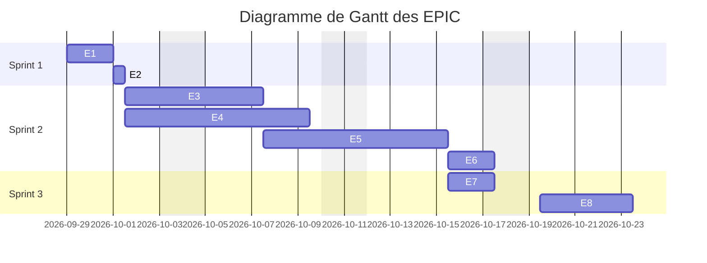
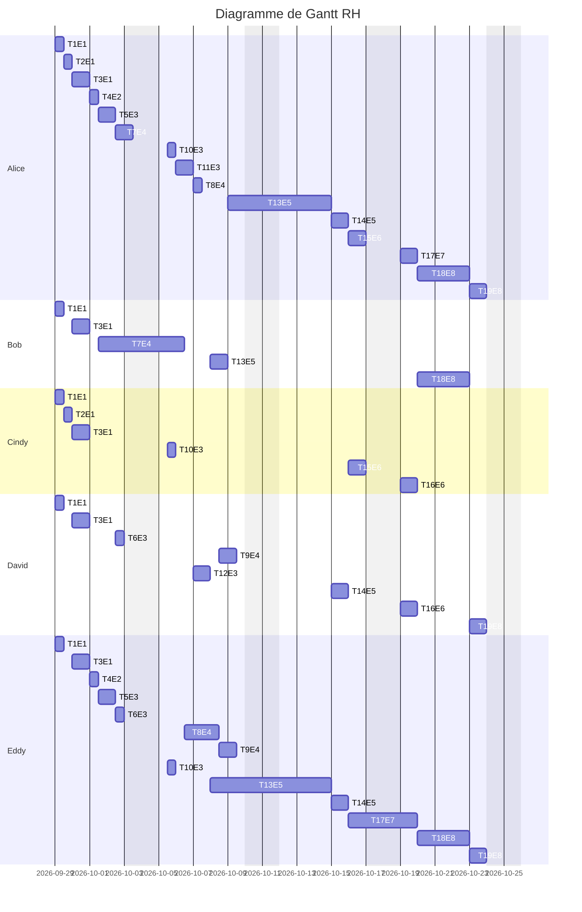
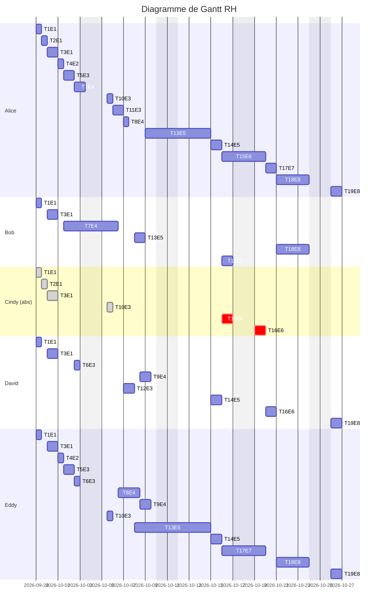

# Plan d'action du ticket #1664

## L'équipe

- **Alice :** Moi-même, touche à tout avec 5 ans d'expérience
- **Bob :** Lead dev, excellent tech, 10 ans d'expérience, peu de disponibilité
- **Cindy :** UX designer avec 2 ans d'expérience
- **David : ** QA avec 3 ans d'expérience
- **Eddy : ** Alternant M2STLRES 

## Plan d'action - Backlog

| ID    | Nom                                            | Description                                                  | Temps (en journée) | Epic                           | Priorité |
| ----- | ---------------------------------------------- | ------------------------------------------------------------ | ------------------ | ------------------------------ | -------- |
| T1E1  | Choix des technologies                         | Choisir les différentes technologies utilisées pour le projet | 1/2 Journée        | Architecture                   | Haut     |
| T2E1  | Création de la maquette                        | Créer la maquette des différentes pages. Le projet a une UI très simple | 1/2 Journée        | Architecture                   | Moyen    |
| T3E1  | Créer les environnements                       | Une fois les technologies choisis créer les différent environnement de développement et de préproduction | 1 Journée          | Architecture                   | Haut     |
| T4E2  | Récolte des données                            | Récolter les URL d'image pour populer la DB                  | 1/2 Journée        | Data et stockage               | Moyen    |
| T5E3  | Fonctionnalité "Recherche"                     | Permet de rechercher des URL par mot-clef exact              | 1 Journée          | Recherche Simple et classement | Moyen    |
| T6E3  | Test de la fonctionnalité "Recherche"          | Test de la fonctionnalité "Recherche"                        | 1/2 Journée        | Recherche Simple et classement | Haut     |
| T7E4  | Créer le système de parser de regex            | Création d'un système de parsing de regex pour pouvoir lire efficacement les regex | 3 Journées         | Recherche avancée              | Moyen    |
| T8E4  | Fonctionnalité de "Recherche avancée"          | Permet de rechercher des URL par regex en utilisant le parser créé précédemment | 2 Journées         | Recherche avancée              | Moyen    |
| T9E4  | test de la "recherche avancée"                 | Test de la recherche avancée                                 | 1 Journée          | Recherche avancée              | Haut     |
| T10E3 | Choix des systèmes de classements proposés     | Choisir le ou les systèmes de classements qui vont être proposé à l'utilisateur. | 1/2 Journée        | Recherche Simple et classement | Haut     |
| T11E3 | Implémentation des systèmes de classement      | Implémentation du ou des systèmes de classements choisis précédemment | 1 Journée          | Recherche Simple et classement | Moyen    |
| T12E3 | Test du système de classement                  | Test du système de classement implémenté                     | 1 Journée          | Recherche Simple et classement | Haut     |
| T13E5 | Fonctionnalité de "recherche multiple"         | Implémentation de la recherche multiple permettant de rechercher avec plusieurs mots | 5 Journées         | Recherche multiple             | Haut     |
| T14E5 | Test de la fonctionnalité "recherche multiple" | Test de la fonctionnalité de la recherche multiple           | 1 journée          | Recherche multiple             | Haut     |
| T15E6 | Implémentation de l'UI                         | Implémentation de l'IU en suivant la maquette précédemment fixée | 1 Journées         | UI                             | Bas      |
| T16E6 | Test de l'UI                                   | Test de l'UI                                                 | 1 Journée          | UI                             | Bas      |
| T17E7 | Écriture de la documentation de l'API          | Écrire la documentation de l'API pour permettre a de futur développeurs | 2 Journées         | Documentation                  | Moyen    |
| T18E8 | Intégration                                    | Intégrations des différents éléments                         | 3 Journées         | Intégration                    | Haut     |
| T19E8 | Test d'intégration                             | Test de l'intégration                                        | 1 Journée          | Intégration                    | Haut     |

### Liste des EPIC

- E1 - Architecture (2 J)
- E2 - Data et stockage (1/2 J)
- E3 - Recherche Simple et classement (4 J)
- E4 - Recherche avancée (6 J)
- E5 - Recherche multiple (6 J)
- E6 - UI (2 J)
- E7 - Documentation (2 J)
- E8 - Intégration (4 J)

## Diagrammes

### EPIC



- **Sprint 1 - Conception et préparation** 

On commence par l'Epic 1 pour mettre au point l'architecture du projet et choisir les technologies qui vont être utilisées pour le projet. On poursuit en remplissant la base de donnée et créer les différents environnements.

- **Sprint 2 - Développements**

On va développer les différentes fonctionnalités du projet en essayant de les paralléliser au possible. Une fois l'ensemble terminer on passe à l'UI. On peut se permettre d'attendre la fin du développement du backend pour commencer l'UI car ce dernier est assez court à développer.

- **Sprint 3 - Intégration et documentation**

On va créer la documentation de l'API en parallèle de l'UI puis se lancer dans l'intégration de l'UI et du backend et ses tests avant la livraison finale du POC.

### RH



- **Alice**

En tant que chef de projet elle intervient sur la quasi intégralité du projet et a une vision sur toute les tâches.

- **Bob**

Etant très occupé par d'autre part mais particulièrement efficace on lui fait débuter les parties compliquée du projet pour que d'autre puissent ensuite terminer.

- **Cindy**

Créer la maquette de l'UI et participe au choix du classement des réponses pour que ce dernier soit le plus pratique possible pour l'utilisateur. Elle va aussi implémenter le front end car ce dernier est suffisamment simple pour ne pas nécessité d'expert.

- **David**

Va tester toutes les fonctionnalité, souvent assisté d'Alice ou d'Eddy pour lui apprendre comment se font les tests.

- **Eddy**

Participe a la plupart du projet de façon a apprendre un maximum de chose. On lui fait rédiger la documentation pour qu'il ait une vision d'nesemble sur le projet et puisse plus simplement l'intégrer a son mémoire.

## Mail de réponse

> Bonjour M.X,
>
> Veuillez trouver ci-joint l'organisation de l'équipe qui m'est allouée pour le développement du moteur de recherche d'image.
>
> J'ai essayé au mieux de concilier les forces de chacun et leurs disponibilités.
>
> Nous pensons pouvoir terminer le projet pour fin Octobre.
>
> Cordialement,
> Alice

# Semaine 2

## RH

Pour rappel les correspondances entre les indicatifs des tâches et leur noms réels est trouvable dans la backlog accompagnant mon dernier mail.




Visisble en gris les tâches où la présence de Cindy n'était pas critique, c'est à dire toute les participations a des prises de décisions. En rouge les tâches où sa présence était critique. 

Elle sera donc efficacement remplacée par Bob et moi. Bob n'aura qu'un jour de présence en plus de façon a avoir un kickoff énergique sur le frontend. Je réduis ma présence sur l'écriture de la documentation en déléguant cette charge a Eddy, je ferais une relecture de tout cela durant une journée tout de même.

Les tests de front end ne deviendront plus que la seule charge de David qui saura se débrouiller parfaitement.

Cette organisation permet de limiter le retard en passant d'une deadline annoncée le 24/10 au 27/10.

# Semaine 3

## Description des tests

On suppose que les tags sont a 100% issus des URL des images.

### E3

<u>TE1E3</u> : **Tester que les images retournées sont les bonnes avec un mot simple**

- **Input : ** fait la requête `/myImageFromKeyword/salmon/`

- **Conditions a respecter pour que le test passe :**

  - 11 Résultats

  - Que chaque images aient le tag "*salmon*"

  - Qu'avec la base de test on ait ces résultats :
  	```
    https://image.freepik.com/free-photo/tomato-vegetable-salad-with-smoked-salmon-meat_74190-2776.jpg
    https://image.freepik.com/free-photo/salmon-salad_74190-601.jpg
    https://image.freepik.com/free-vector/seafood-realistic-set-with-whole-fresh-salmon-shrimps-squid-slices-octopus-tentacles-mussels-transparent_1284-31935.jpg
    https://image.freepik.com/free-vector/seafood-cocktail-ingredients-realistic-composition-with-whole-fresh-salmon-fish-shrimps-octopus-tentacle-lemon-herbs_1284-31931.jpg
    https://image.freepik.com/free-vector/salmon-sushi-cartoon-icon-illustration-japanese-food-icon-concept-isolated-flat-cartoon-style_138676-2569.jpg
    https://image.freepik.com/free-photo/delicious-fresh-salmon-fish_23-2148708708.jpg
    https://image.freepik.com/free-photo/raw-salmon-fillet-ingredients-cooking_2829-5177.jpg
    https://image.freepik.com/free-photo/whole-salmon-isolated-white_95419-4457.jpg
    https://image.freepik.com/free-vector/salmon-fish-raw-steaks-caviar-icons-set-isolated-white_1284-33354.jpg
    https://image.freepik.com/free-photo/grilled-salmon-with-various-vegetables-plate_1205-8061.jpg
    https://image.freepik.com/free-photo/raw-salmon-fish-vintage-pan_1220-3157.jpg
    ```

<u>TE2E3</u> : **Tester que la recherche avec des caractères spéciaux ne retournent rien**

- **Input : ** fait la requête `/myImageFromKeyword/thé/`

- **Conditions a respecter pour que le test passe :**

  - 0 Résultats
- Que le retour de résultats vide ne pose pas de soucis particulier (crash etc...)

<u>TE3E3</u> : **Tester que la recherche un mot est correctement classée**

- **Input : ** fait la requête `/myImageFromKeyword/grilled/`

- **Conditions a respecter pour que le test passe :**
  - 3 Résultats
  - Que le classement des liens correspondent a celui decidé durant la réunion de T10E3

<u>TE4E3</u> : **Tester dans le backend le précalul de KMP**

- **Input :** Lancer l'algorithme de précalcul sur `["AAAA", "ABCDE", "AABAACAABAA"]`
- **Condition a respecter pour que le test passe :**
  - Il faut que la matrice de résutat soit : `[[0, 1, 2, 3], [0, 0, 0, 0, 0], [0, 1, 0, 1, 2, 0, 1, 2, 3, 4, 5]]`

<u>TE5E3</u> : **Tester dans le backend KMP **

- **Input :** Lancer l'algorithme sur `["lorem", "Donec", "mi", "est", "um"]` avec le texte `"lorem ipsum dolor sit amet, consectetur adipiscing elit. Proin at condimentum lacus, nec finibus orci. Nunc in lectus condimentum, egestas risus a, semper erat. Donec vitae lorem id metus venenatis aliquet ac in nisl. Donec lacinia nibh eget leo mattis tincidunt. Nulla nibh lacus, condimentum eu est non, dictum euismod libero. Aenean tincidunt arcu mauris, a blandit lectus volutpat vel. Curabitur bibendum mi consectetur nulla venenatis, eget ultrices diam iaculis. Maecenas condimentum, tortor sit amet vestibulum semper, turpis velit rhoncus mi, nec gravida risus neque vitae urna. Quisque tincidunt dignissim est, eget dictum sem congue ac. Phasellus vestibulum aliquam lorem"`
- **Condition a respecter pour que le test passe :**
  - Que les posiitions de matchs retournées soient : `[
            [[0, 5], [173, 178], [676, 681]],
            [[161, 166], [218, 223]],
            [[409, 411], [547, 549]],
            [[133, 136], [297, 300], [508, 511], [615, 618], [658, 661]],
            [[9, 11], [75, 77], [127, 129], [291, 293], [310, 312], [406, 408], [487, 489], [515, 517], [629, 631], [665, 667]]
        ]`

### E4

<u>TE6E4</u> : **Tester que les images retournées sont les bonnes avec une regex**

- **Input :** faire la requête `/myImageFromRegex/sea*/`

- **Conditions a respecter pour que le test passe :**

  - 30 résultats
  - Qu'au moins un des tags corresponde à la regex `sea*`
  - Que les liens retournés soient :

  ```
  https://image.freepik.com/free-photo/close-up-mix-seafood-wodden-bottom_23-2148290501.jpg
  https://image.freepik.com/free-photo/top-view-frame-seafood-mix_23-2148290577.jpg
  https://image.freepik.com/free-photo/raw-sea-bream-fish_67618-1464.jpg
  https://image.freepik.com/free-photo/close-up-fresh-fish-meat_23-2148263861.jpg
  https://image.freepik.com/free-photo/set-delicious-sushi-wooden-plate_114579-31714.jpg
  https://image.freepik.com/free-photo/beautiful-shot-common-bottlenose-dolphin-living-his-best-life-sea_181624-26604.jpg
  https://image.freepik.com/free-photo/set-delicious-sushi-with-chopsticks-ginger-marble-surface_114579-32554.jpg
  https://image.freepik.com/free-vector/seafood-flat-icons-big-set_1284-20035.jpg
  https://image.freepik.com/free-vector/set-icons-with-sea-river-fishes-with-inscriptions-white-isolated_1284-26638.jpg
  https://image.freepik.com/free-photo/roasted-fish-garnished-with-lemon-slices-served-with-vegetables_140725-1413.jpg
  https://image.freepik.com/free-vector/seafood-realistic-set-with-whole-fresh-salmon-shrimps-squid-slices-octopus-tentacles-mussels-transparent_1284-31935.jpg
  https://image.freepik.com/free-photo/seafood-dish-assortment-copy-space_23-2148637885.jpg
  https://image.freepik.com/free-vector/seafood-cocktail-ingredients-realistic-composition-with-whole-fresh-salmon-fish-shrimps-octopus-tentacle-lemon-herbs_1284-31931.jpg
  https://image.freepik.com/free-psd/one-fresh-sea-bass-fish-isolated-white-background_88281-3744.jpg
  https://image.freepik.com/free-photo/two-raw-seabass-with-spices_2829-13950.jpg
  https://image.freepik.com/free-vector/salmon-sushi-cartoon-icon-illustration-japanese-food-icon-concept-isolated-flat-cartoon-style_138676-2569.jpg
  https://image.freepik.com/free-photo/flying-food-raw-sea-bass-fish-with-spices_136595-4.jpg
  https://image.freepik.com/free-photo/set-delicious-sushi-roll-marble-surface_114579-31713.jpg
  https://image.freepik.com/free-photo/thai-food-mackerel-chili-paste-served-with-fried-mackerel-sticky-rice_1150-35229.jpg
  https://image.freepik.com/free-photo/fresh-sea-bass-fish-ingredients-cooking-lemon-rosemary-white-background-top-view_101035-101.jpg
  https://image.freepik.com/free-photo/top-view-delicious-exotic-seafood-dish_23-2148637868.jpg
  https://image.freepik.com/free-vector/seafood_1308-33382.jpg
  https://image.freepik.com/free-photo/still-life-with-uncooked-seafoods_1398-3683.jpg
  https://image.freepik.com/free-photo/fresh-sea-bream-hanged-tail-rope-center_346278-487.jpg
  https://image.freepik.com/free-vector/salmon-fish-raw-steaks-caviar-icons-set-isolated-white_1284-33354.jpg
  https://image.freepik.com/free-vector/fish-sea_1308-26790.jpg
  https://image.freepik.com/free-vector/two-japanese-koi-fish-swimming_53876-16876.jpg
  https://image.freepik.com/free-photo/roasted-seabass-with-vegetables_2829-14260.jpg
  https://image.freepik.com/free-photo/grilled-fish-close-up-decorated-with-vegetables_1303-12328.jpg
  https://image.freepik.com/free-photo/seafood-plate-with-shrimps-mussels-lobsters-served-with-lemon_140725-8798.jpg
  ```

<u>TE7E4</u> : **Tester que les images retournées sont les bonnes avec une regex** **complexe**

- **Input :** faire la requête `/myImageFromRegex/w*|(b+|d+)|se/`

- **Conditions a respecter pour que le test passe :**

  - 99 résultats
  - Qu'au moins un des tags corresponde à la regex `w*|(b+|d+)|se`
  - Que les liens retournés soient :

  ```
  https://image.freepik.com/free-photo/top-view-fresh-fishes-ice-cubes_23-2148295258.jpg
  https://image.freepik.com/free-photo/close-up-mix-seafood-wodden-bottom_23-2148290501.jpg
  https://image.freepik.com/free-photo/top-view-fresh-fishes-with-gills-ice_23-2148295250.jpg
  https://image.freepik.com/free-photo/raw-red-prawns-sale_449-19326194.jpg
  https://image.freepik.com/free-photo/top-view-frame-seafood-mix_23-2148290577.jpg
  https://image.freepik.com/free-photo/clupeidae-fresh-small-fishes_1205-2205.jpg
  https://image.freepik.com/free-photo/black-tilapia-tilapia_1339-853.jpg
  https://image.freepik.com/free-photo/cut-parsley-spices-near-fish_23-2147753651.jpg
  https://image.freepik.com/free-photo/raw-sea-bream-fish_67618-1464.jpg
  https://image.freepik.com/free-photo/top-view-fresh-fish-with-lemon_23-2148290570.jpg
  https://image.freepik.com/free-photo/close-up-fresh-fish-meat_23-2148263861.jpg
  https://image.freepik.com/free-photo/tomato-vegetable-salad-with-smoked-salmon-meat_74190-2776.jpg
  https://image.freepik.com/free-photo/goldfish-fish-tank_33751-480.jpg
  https://image.freepik.com/free-photo/sashimi_74190-2351.jpg
  https://image.freepik.com/free-photo/salmon-salad_74190-601.jpg
  https://image.freepik.com/free-photo/hanging-octopus-fish-market_449-19325810.jpg
  https://image.freepik.com/free-photo/set-delicious-sushi-wooden-plate_114579-31714.jpg
  https://image.freepik.com/free-photo/various-ingredients-shabu-hot-pot-with-sauce_1150-35281.jpg
  https://image.freepik.com/free-photo/various-ingredients-shabu-hot-pot-with-sauce_1150-35282.jpg
  https://image.freepik.com/free-vector/fish-logo-template_15146-147.jpg
  https://image.freepik.com/free-photo/beautiful-shot-common-bottlenose-dolphin-living-his-best-life-sea_181624-26604.jpg
  https://image.freepik.com/free-photo/set-delicious-sushi-with-chopsticks-ginger-marble-surface_114579-32554.jpg
  https://image.freepik.com/free-vector/seafood-flat-icons-big-set_1284-20035.jpg
  https://image.freepik.com/free-photo/fresh-bass-with-white-background_1203-1781.jpg
  https://image.freepik.com/free-vector/set-icons-with-sea-river-fishes-with-inscriptions-white-isolated_1284-26638.jpg
  https://image.freepik.com/free-photo/roasted-fish-garnished-with-lemon-slices-served-with-vegetables_140725-1413.jpg
  https://image.freepik.com/free-vector/seafood-realistic-set-with-whole-fresh-salmon-shrimps-squid-slices-octopus-tentacles-mussels-transparent_1284-31935.jpg
  https://image.freepik.com/free-photo/baked-fish-dorado-with-lemon-herbs-baking-pan_2829-11060.jpg
  https://image.freepik.com/free-photo/seafood-dish-assortment-copy-space_23-2148637885.jpg
  https://image.freepik.com/free-vector/seafood-cocktail-ingredients-realistic-composition-with-whole-fresh-salmon-fish-shrimps-octopus-tentacle-lemon-herbs_1284-31931.jpg
  https://image.freepik.com/free-photo/raw-fish-market_1398-2421.jpg
  https://image.freepik.com/free-psd/one-fresh-sea-bass-fish-isolated-white-background_88281-3744.jpg
  https://image.freepik.com/free-photo/round-scad-fish_1205-2098.jpg
  https://image.freepik.com/free-photo/two-raw-seabass-with-spices_2829-13950.jpg
  https://image.freepik.com/free-photo/bluefin-tuna-really-fresh-isolated-white_79295-2.jpg
  https://image.freepik.com/free-vector/salmon-sushi-cartoon-icon-illustration-japanese-food-icon-concept-isolated-flat-cartoon-style_138676-2569.jpg
  https://image.freepik.com/free-photo/hot-pot-shabu-raw-fresh-sliced-fish-plate_1150-35268.jpg
  https://image.freepik.com/free-photo/indian-mackerel-rastrelliger-kanagurta_1205-2588.jpg
  https://image.freepik.com/free-vector/drink-like-fish_1308-17737.jpg
  https://image.freepik.com/free-vector/fish_53876-59060.jpg
  https://image.freepik.com/free-photo/fresh-mackerel-steak_1339-3349.jpg
  https://image.freepik.com/free-photo/fresh-fish-white_144627-24519.jpg
  https://image.freepik.com/free-photo/halfmoon-betta-fish_1150-7812.jpg
  https://image.freepik.com/free-photo/flying-food-raw-sea-bass-fish-with-spices_136595-4.jpg
  https://image.freepik.com/free-vector/simple-fish-cartoon-character_1308-26444.jpg
  https://image.freepik.com/free-photo/raw-fish-market_1398-2423.jpg
  https://image.freepik.com/free-photo/set-delicious-sushi-roll-marble-surface_114579-31713.jpg
  https://image.freepik.com/free-photo/thai-food-mackerel-chili-paste-served-with-fried-mackerel-sticky-rice_1150-35229.jpg
  https://image.freepik.com/free-photo/fresh-sea-bass-fish-ingredients-cooking-lemon-rosemary-white-background-top-view_101035-101.jpg
  https://image.freepik.com/free-photo/top-view-fish-blue-background_23-2148736935.jpg
  https://image.freepik.com/free-photo/delicious-fresh-salmon-fish_23-2148708708.jpg
  https://image.freepik.com/free-photo/top-view-fish-with-herbs-lemon_23-2148754809.jpg
  https://image.freepik.com/free-photo/betta-fish_1150-7907.jpg
  https://image.freepik.com/free-vector/fish-out-water_1043-38.jpg
  https://image.freepik.com/free-photo/pickled-atlantic-herring-fishes-cutting-board_166373-878.jpg
  https://image.freepik.com/free-photo/top-view-fish-frame-with-copy-space_23-2148736924.jpg
  https://image.freepik.com/free-photo/top-view-delicious-exotic-seafood-dish_23-2148637868.jpg
  https://image.freepik.com/free-vector/seafood_1308-33382.jpg
  https://image.freepik.com/free-photo/mackerel-market_1150-11085.jpg
  https://image.freepik.com/free-photo/raw-salmon-fillet-ingredients-cooking_2829-5177.jpg
  https://image.freepik.com/free-photo/betta-fish_1150-7905.jpg
  https://image.freepik.com/free-photo/raw-fish-market_1398-2423.jpg
  https://image.freepik.com/free-photo/red-mullet-fish-isolated-white-background_1205-513.jpg
  https://image.freepik.com/free-photo/still-life-with-uncooked-seafoods_1398-3683.jpg
  https://image.freepik.com/free-photo/cracker-with-red-caviar-wood_114579-31069.jpg
  https://image.freepik.com/free-photo/mix-sushi-red-caviar-blue-surface_114579-31807.jpg
  https://image.freepik.com/free-photo/delicious-sushi-with-caviar-ginger-vasabi-wooden-plate_114579-31736.jpg
  https://image.freepik.com/free-photo/indian-mackerel-rastrelliger-kanagurta_1205-2582.jpg
  https://image.freepik.com/free-vector/goldfish-cartoon_1366-254.jpg
  https://image.freepik.com/free-photo/betta-fish_1150-7895.jpg
  https://image.freepik.com/free-photo/tilapia-raw_1339-896.jpg
  https://image.freepik.com/free-photo/sardines-sale-container_449-19326263.jpg
  https://image.freepik.com/free-photo/fried-fish-carp-fresh-vegetable-salad-flat-lay-top-view_2829-19949.jpg
  https://image.freepik.com/free-photo/fresh-whole-fish_1203-1783.jpg
  https://image.freepik.com/free-photo/whole-salmon-isolated-white_95419-4457.jpg
  https://image.freepik.com/free-photo/fresh-sea-bream-hanged-tail-rope-center_346278-487.jpg
  https://image.freepik.com/free-photo/fresh-fish-white_144627-24518.jpg
  https://image.freepik.com/free-vector/salmon-fish-raw-steaks-caviar-icons-set-isolated-white_1284-33354.jpg
  https://image.freepik.com/free-vector/watercolor-fish-background_1176-201.jpg
  https://image.freepik.com/free-photo/flat-lay-fishes-with-fishing-net_23-2148736934.jpg
  https://image.freepik.com/free-vector/fish-sea_1308-26790.jpg
  https://image.freepik.com/free-vector/two-japanese-koi-fish-swimming_53876-16876.jpg
  https://image.freepik.com/free-photo/fried-fish-with-grilled-eggplants-bell-peppers-tomatoes-sauce_141793-736.jpg
  https://image.freepik.com/free-photo/grilled-salmon-with-various-vegetables-plate_1205-8061.jpg
  https://image.freepik.com/free-photo/roasted-seabass-with-vegetables_2829-14260.jpg
  https://image.freepik.com/free-photo/grilled-fish-close-up-decorated-with-vegetables_1303-12328.jpg
  https://image.freepik.com/free-photo/blackout-piranha_181624-4130.jpg
  https://image.freepik.com/free-photo/top-view-fish-frame-with-ice-lemon_23-2148754807.jpg
  https://image.freepik.com/free-photo/frame-with-fresh-fish-condiments_23-2148290465.jpg
  https://image.freepik.com/free-photo/octopus-sale-fish-market_449-19326006.jpg
  https://image.freepik.com/free-photo/fried-fish-carp-fresh-vegetable-salad-wooden-table-flat-lay-top-view_2829-19944.jpg
  https://image.freepik.com/free-photo/fresh-fish-dorado_87742-8770.jpg
  https://image.freepik.com/free-photo/seafood-plate-with-shrimps-mussels-lobsters-served-with-lemon_140725-8798.jpg
  https://image.freepik.com/free-photo/live-lobster_163068-31.jpg
  https://image.freepik.com/free-photo/fresh-butterfish_1205-2201.jpg
  https://image.freepik.com/free-photo/frame-top-view-fish-copy-space_23-2148708640.jpg
  https://image.freepik.com/free-photo/raw-salmon-fish-vintage-pan_1220-3157.jpg
  https://image.freepik.com/free-photo/bigeye-fish-isolated-white-background_1205-642.jpg
  https://image.freepik.com/free-photo/fresh-butterfish_1205-2198.jpg
  ```

<u>TE8E4</u>: **Tester qu'une mauvaise regex renvoie bien une erreur gérée et ne plante pas**

- **Input :** faire une requête `/myImageFromRegex/+|/`
- **Conditions a respecter pour que le test passe :**
  - Que l'erreur soit correctement gérée par l'API et qu'elle ne retourne pas internal error
  - 0 résultats

<u>TE9E4</u> : **Tester que la recherche avec regex est correctement classée**

- **Input : ** fait la requête `/myImageFromKeyword/ja*/`

- **Conditions a respecter pour que le test passe :**
  - 2 Résultats
  - Que le classement des liens correspondent a celui decidé durant la réunion de T10E3

<u>TE10E4</u> : **Tester l'AST généré par la lecture d'une regex**

- **Input : ** Faire tourner l'algorithme de conversion `a*, a+, a|b, ab`

- **Conditions a respecter pour que le test passe :**
  - Qu'en retour on est les AST `*(a), +(a), |(a,b), .(a,b)`

<u>TE11E4</u> : **Tester l'automate générer depuis un AST**

- **Input : ** Faire tourner les algorithmes sur `*(a), +(a), |(a,b), .(a,b)`

- **Conditions a respecter pour que le test passe :**
  - Qu'en retour on est les automates correspondants

<u>TE12E4</u> : **Tester la déterminisation de l'automate**

- **Input : ** Faire tourner l'alogrithme de déterminisation sur des automates non déterminisés

- **Conditions a respecter pour que le test passe :**
  - Avoir les automates déterminisés correspondant

<u>TE13E4</u> : **Tester la minisation de l'automate**

- **Input : ** Faire tourner l'algorithme de minimisation sur des algorithmes déterminés

- **Conditions a respecter pour que le test passe :**
  - Avoir les automates minimisés correspondant

<u>TE15E4 :</u> **Tester la lecture d'un texte depuis une regex dans le backend (sans API)**

- **Input : ** Faire tounrer l'algorithme sur une regex

- **Conditions a respecter pour que le test passe :**
  - Verifier que dans un texte donné nous récupérons les bons matchs

### E5

<u>TE16E5</u> : **Tester que les magic number sont correctement compris par la fonction de recherche**

- **Input : ** fait la requête `/myImageFromKeyword/ja*/`

- **Conditions a respecter pour que le test passe :**
  - 2 Résultats
  - Que le classement des liens correspondent a celui decidé durant la réunion de T10E3

<u>TE17E5</u> : **Tester la recherche multiple pour un mot**

- **Input : ** fait la requête `/myImageFromKeyword/ja*/`

- **Conditions a respecter pour que le test passe :**
  - 2 Résultats
  - Que le classement des liens correspondent a celui decidé durant la réunion de T10E3

<u>TE18E5</u> : **Tester la recherche multiple pour plusieurs mots**

- **Input : ** fait la requête `/myImageFromKeyword/ja*/`

- **Conditions a respecter pour que le test passe :**
  - 2 Résultats
  - Que le classement des liens correspondent a celui decidé durant la réunion de T10E3

<u>TE19E5</u> : **Tester la recherche multiple pour aucun mot**

- **Input : ** fait la requête `/myImageFromKeyword/ja*/`

- **Conditions a respecter pour que le test passe :**
  - 2 Résultats
  - Que le classement des liens correspondent a celui decidé durant la réunion de T10E3

<u>TE20E5</u> : **Tester la recherche multiple pour deux fois le même mot**

- **Input : ** fait la requête `/myImageFromKeyword/ja*/`

- **Conditions a respecter pour que le test passe :**
  - 2 Résultats
  - Que le classement des liens correspondent a celui decidé durant la réunion de T10E3

<u>TE21E5</u> : **Tester la recherche multiple pour des mots provoquant une collision**

- **Input : ** fait la requête `/myImageFromKeyword/ja*/`

- **Conditions a respecter pour que le test passe :**
  - 2 Résultats
  - Que le classement des liens correspondent a celui decidé durant la réunion de T10E3

## RH

# Semaine 4

## Profile d’Alice sur le Maslow

| Niveaux   | Pourcentage | Commentaire                                                  |
| --------- | ----------- | ------------------------------------------------------------ |
| **Niv 5** | 80%         | Résout les problème qui se présente a elle depuis le début, garde la confiance de ses supérieurs tout en gardant une vie perso agréable. |
| **Niv 4** | 70%         | Après un Master STL on ne peut qu'avoir une haute estime de soi ! |
| **Niv 3** | 80%         | A une famille et un groupe d'amis aimant, ses collègues l'apprécie aussi |
| **Niv 2** | 60%         | Son équipe se délite semaine après semaine, c'est stressant ! |
| **Niv 1** | 90%         | Gagne assez bien leur vie                                    |


## Celui de Gaby 

| Niveaux   | Pourcentage | Commentaire                                                  |
| --------- | ----------- | ------------------------------------------------------------ |
| **Niv 5** | 80%         | Sûr de lui, poisition pro et sociale acquise et stable, estimé dans son champs d'expertise, continu de vivre sur le fil et est donc sûr de sa capacité a toujours assumer un *after-work* arrosé et cher le lendemain autant au travail que dans sa vie perso. |
| **Niv 4** | 80-90%      | Semble avoir une certaine estime de lui-même (proximité avec la direction, forte sociabilité, dev rockstar) |
| **Niv 3** | 80%         | Populaire dans sa vie pro, sa perso ne semble pas un problème |
| **Niv 2** | 60-70%      | Vie comme un invité de la table de Mécène et est donc toujours sur le fil |
| **Niv 1** | 90%         | Gagne assez bien leur vie                                    |


## Celui de Harry

| Niveaux   | Pourcentage | Commentaire                                                  |
| --------- | ----------- | ------------------------------------------------------------ |
| **Niv 5** | 50%         | Heureux d'avoir enfin rejoint le comEx après un parcourt aussi pénible, Harry a besoin de prendre du galon, a défaut d'avoir du talent, pour être mieux vu socialement. |
| **Niv 4** | 40%         | Court après Alice et est particulièrement démago. Il sait qu'il a besoin d'elle pour s'assurer une promotion dans la hiérarchie. |
| **Niv 3** | 30%         | Mal aimé dans sa famille, mal aimé en milieu pro             |
| **Niv 2** | 80%         | Issu de la haute société, stabilité dans les revenus et dans l'abri (possède un grand domaine) |
| **Niv 1** | 90%         | Gagne assez bien leur vie                                    |


## Critiques du modèle de Maslow

Le modèle est criticable sur plusieurs point si l'ont en croit son article wikipédia :

- Manque de donnée sur lequelles s'est basé M.Maslow
- Modèle applicable principlement aux populations occidentales
- Aucun lien de causalité n'a jamais été prouvé entre les différents besoins et Maslow lui-même n'a jamais cherché à les montrer
- La modèle est quasiment totalement réfuté de nos jours par le monde scientifique

## Votre choix final du nouveau chef d’équipe

En terme de choix final je prendrais Gaby, en effet ce dernier est un collègue sympathique et particulièrement compétent. 

Si ce dernier n'est pas disponible je préférais prendre moi même le poste que de laisser le poste a un opportuniste incompétent et mal dans ses bottes qui ne manquerait pas de faire capoter le projet et de faire porter le chapeau a un des membres de l'équipe pour ne se ajouter un nouvel échec a son parcours.

