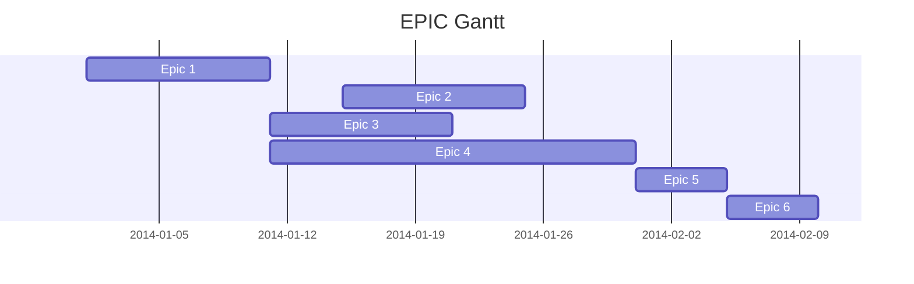

# GPSTL

**Q: Qu'est ce qu'un bon poste en IT ?**

- Un poste intéressant
- Un poste évolutif
- Un poste où on suit l'évolution de la techno
- Un poste bien payé

## Prévisions pour le projet

**Sujet :** Conuite du POC#1664

**Equipe :**

- Equipe minimum :
  - Lead dev : découpe du travail + base de donnée/archi/éléments simple/front/QA
  - Dev : Feature complexe de recherche/QA
- Equipe idéale
  - Lead dev : Découpe du travail / archi / front
  - Dev database :  DB
  - Dev : recherches simples/QA
  - Dev : recheche relou avec regex et moteur regex etc

**Durée :**

- Equipe minimum :
  - 3 semaines jour ouvrés
- Equipe idéale :
  - 2 semaines jour ouvrés

## Cours

... (récupérer sur ale)

## Découpage du travail

- RH
- Gantt micro
- Gantt macro
- Cohérange des points précendents

### Découpage en EPIC

E1 : Archi + techno

E2 : data collection + stockage

E3 : recherche simple (E3S1), classement des rép (E3S2)

E4 : recherche multiple

E5 : intégration

On ne peut pas présenter le projet et les EPIC sur le même Gantt il faut en faire un autre.

## Préparation du contrôle

L'équipe : 

- Vous : 5 ans d'XP, rôle libre
- Rockstar dev : 10 ans d'XP
- UX
- QA
- M2 Alternant STL

Sous format du cahier des charges

