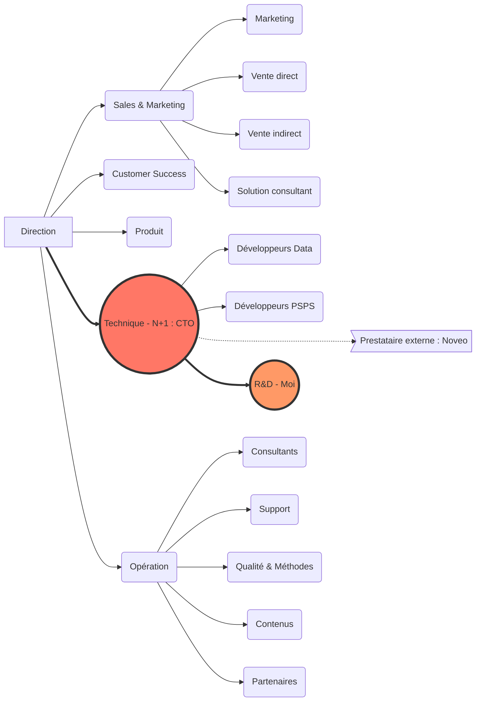

# Mon entreprise

**Nom : ** Peoplespheres

## Organigramme

##  Produit

Plateforme modulaire de SIRH permettant de centraliser l'ensemble des logiciels RH d'une entreprise.

## Client

Entreprises | B2B

## Sponsor

Le CTO