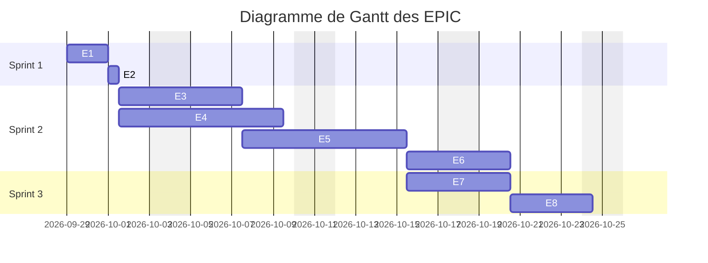
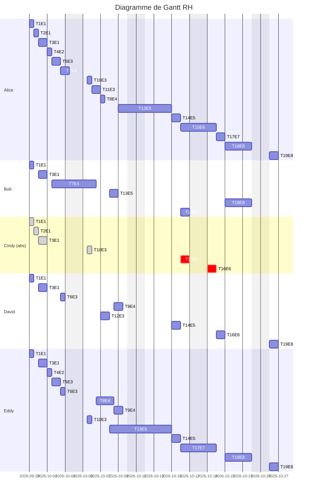

# Changements impliqués par Cindy

## EPIC

Les EPIC changent un peu :

- E6 passent de 2 jours a 3 car ce n'est plus une spécialiste qui s'en charge
- E7 passe de 2 jours à 3 jours pour qu'Alice est le temps de relire la documentation écrite par Eddy

## RH

Pour rappel les correspondances entre les indicatifs des tâches et leur noms réels est trouvable dans la backlog accompagnant mon dernier mail.

Visisble en gris les tâches où la présence de Cindy n'était pas critique, c'est à dire toute les participations a des prises de décisions. En rouge les tâches où sa présence était critique. 

Elle sera donc efficacement remplacée par Bob et moi. Bob n'aura qu'un jour de présence en plus de façon a avoir un kickoff énergique sur le frontend. Je réduis ma présence sur l'écriture de la documentation en déléguant cette charge a Eddy, je ferais une relecture de tout cela durant une journée tout de même.

Les tests de front end ne deviendront plus que la seule charge de David qui saura se débrouiller parfaitement.

Cette organisation permet de limiter le retard en passant d'une deadline annoncée le 24/10 au 27/10.
