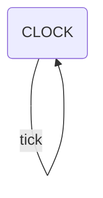

# PPC

## Glossaire

[**Beta reduction** :](https://wiki.haskell.org/Beta_reduction) A *beta reduction* (also written *β reduction*) is the process of calculating a result from the application of a function to an expression.

## Introduction

Démonstration par le "ou" concurrent qu'il est nécessaire de créer des programmes parallèles et donc d'abandonner le lambda calcul car il ne peut pas marcher. On va utiliser le **$$\pi$$ calcul**.

La différence entre concurrence et parallélisme c'est :

- La concurrence va organiser de façon séquentiel le travail pour alterner rapidement entre les différentes tâches et simuler le fait que plusieurs applications s'exécute en même temps.
- La parallélisme c'est quand on organise ce "en même temps" pour de vrai.

 ## Réseau de Petri

Proposé par M.Petri en 1962. 

Le réseau de Petri est composé de trois éléments :

- Les places 
- Les transitions
- Les jetons
- Les arcs

## CSP

(récupérer le cours)

### Notation

$$\frac{\text{condition}}{\text{conséquence}}$$

### Exemple du marteau

Ici nous prenons des objets soit fort, soit faible. Et deux marteaux, soit en bois, soit en fer. 

Les actions sont :

*act = (objf, objd, pnf, pnb, lnf, lnb, $$\tau$$, out)* cela correspond à Objet Faible, Objet Dur, Prendre marteau Bois, Prendre marteau Fer, Libérer marteau Fer, Libérer marteau Bois, faire le travail, terminer.

Ensemble des actions possible avec le marteau en fer va s'écrire :

$$MF = pnf . lnf, MF$$

Pour le Bois :

$$MB = pnb . lnb . MB$$

Si on créer un processus "Ouvrier" il va pouvoir faire :

$$O = objf . \overline{pnb} . \tau . \overline{lnb} . out . O + objd . \overline{pnf} . \tau . \overline{lmf} . out . O$$ (Le "+" est a comprendre comme un "XOR")

 $$\bold{M(pm, dm) = pm.dm . M<pm,dm>}$$​​​

Si on veut sécuriser le marteau fer il faut le protéger en interne :

Pour cela on va utiliser la notation "$$\nu \ a$$" pour protéger "a"

$$(\nu \ pnf) SYSTEM = M<pnf, dnf> | M<pnb, dnb>$$​​​​ 

### Réactions alternatives

**Réaction :**
$$
\nu \ a((a.Q_1+b.Q_2)|\overline{a})|(\overline{b}.R_1+\overline{a}.R_2) \\
\nu \ a(Q_2|\overline{a})|R_1 \\ 
\text{Mais n'est pas égale a :} \ \nu \ a(Q_1|\overline{a})|R_2 \text{ Car a est protégé par }\nu
$$

### Réplication

Les états de mon processus sont : $$ P::= \empty \  | \ \alpha.P  \ |\ P+P \ | \ P|P \ | \ \nu a P \ | \ !P$$​

Comme il y'a $$!P$$​ c'est un processus persistant, car cela génére une infinité de P.

$$ \text{CLOCK}(t)=t.\text{CLOCK}<t>$$

$$
!aP|\overline{a}.Q \\
!aP \ | \ P|Q
$$

 

e
