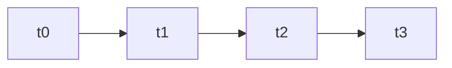
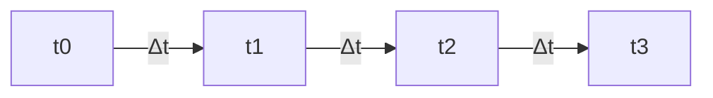

# PPC - Session 2

## Systèmes réactifs

Différence d'un système réactif et interactif : **Qui possède le contrôle des actions**

**Interactif :** C'est le programme qui prend la décision d'exécuter les actions.

**Réactif : ** C'est l'environnement qui prend la décision d’exécuter les actions via un jeu d'évènement.

## Deux modes d'exécution synchrone classiques

**Temps réels :**

**Temps logique :**

Avec `Δt` un temps constant.

## Dataflow

Cela permet de faire du calcul sur le flux de donnée en faisant passer le flow dans des fonctions successives (un peu a la façon de Talend DI). Le langage par excellence pour cette question est [Pure Data](https://en.wikipedia.org/wiki/Pure_Data#Data_structures). 

### Static data flow

...

### Les équations de balance

L'idée c'est d'éviter que le programme s'arrête et donc de pouvoir le lancer à l'infini et de pouvoir réserver la mémoire nécessaire pour exécuter le programme. Pour cela on va s'appuyer sur des schémas et des équations de balance permettant de déterminer combien de mémoire est nécessaire de réserver.

